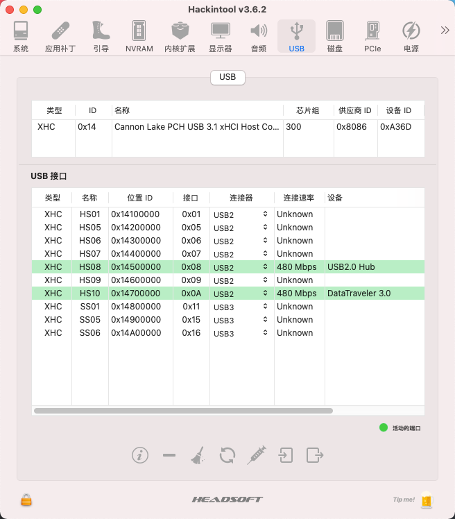
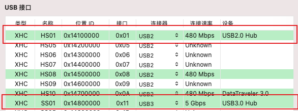
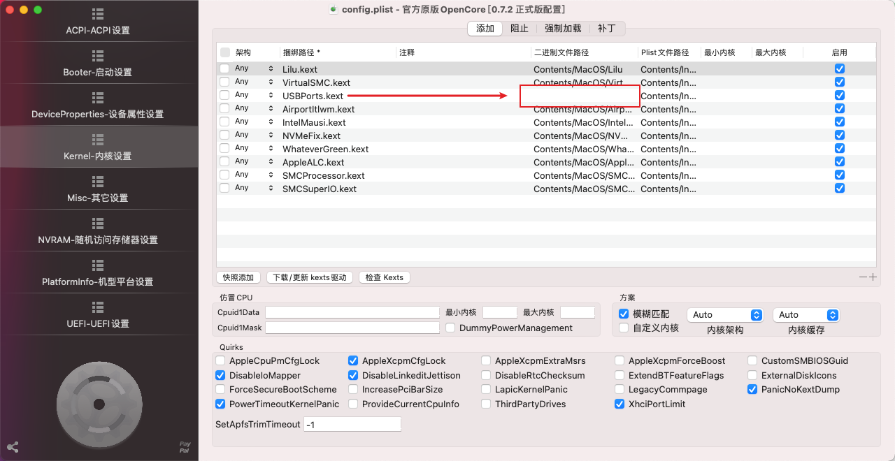
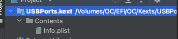
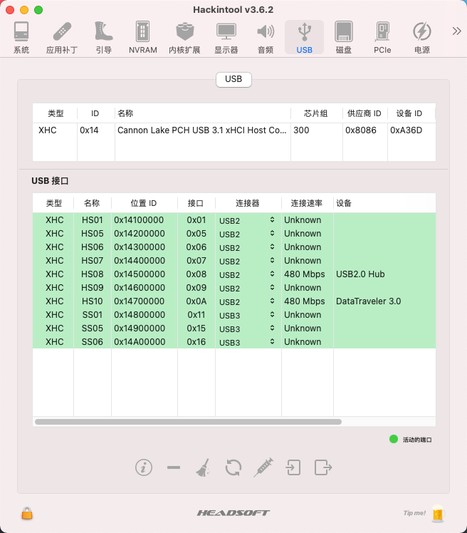

# i5 8500 + GIGABYTE b360m d3h hacktintosh efi

## 配置过程中的一些小总结:

----

## 1. USB定制:

主要使用到的工具是 hackintool:



> 1. 绿色表示能够识别出USB的USB接口.
>
> 2. 白色表示系统扫描到,但是还没有USB插入过的接口.

要定制USB接口,实际上只需要拿出不同类型的USB去一个一个的插电脑上的USB接口.<font color=red>要注意的是: USB3.0接口可以向下兼容USB2.0设备,所以如果用USB2.0设备去插3.0接口,可能之后在hackintool中识别出USB2.0的接口.</font>可以根据hackintool中连接速率判断识别到的是2.0还是3.0



所有的接口都插了一遍之后,点hackintool导出USB接口驱动`USBxxx.kext`


导出了之后,将`USBPorts.kext`文件放入到`EFI/OC/Kexts`文件夹里面,并将之前使用的`USBInjectAll.kext`文件删除,<font color=red>不然会起冲突</font>



然后配置`config.plist`文件,在内核配置中将`USBInjectAll.kext`相关配置删除掉,<font color=#green>建议在添加`USBPorts.kext`相关配置的时候,直接将文件拖进oc configurator里面</font>,<font color=red>如果手动去配置的话,切记不要在画框的位置抄其他`kext`文件的写法,因为生成的`USBPorts.kext`文件`Contents/MacOS`目录下是没有可执行文件的</font>



如果画框的位置抄了其他文件的配置,就会在启动的时候出现:

```bash
OC：Image Kexts\USBPorts.kext\Contents\MacOS\USBPorts is missing for kext USBPorts.kext ()
Halting on critical error
```

**定制完成效果图:**



-----

## 2021.09.09 目前存在的问题:

### 1. 开机启动的时候hdmi闪烁,需要插拔一次才能正常使用,否则还可能影响dp接口的显示.